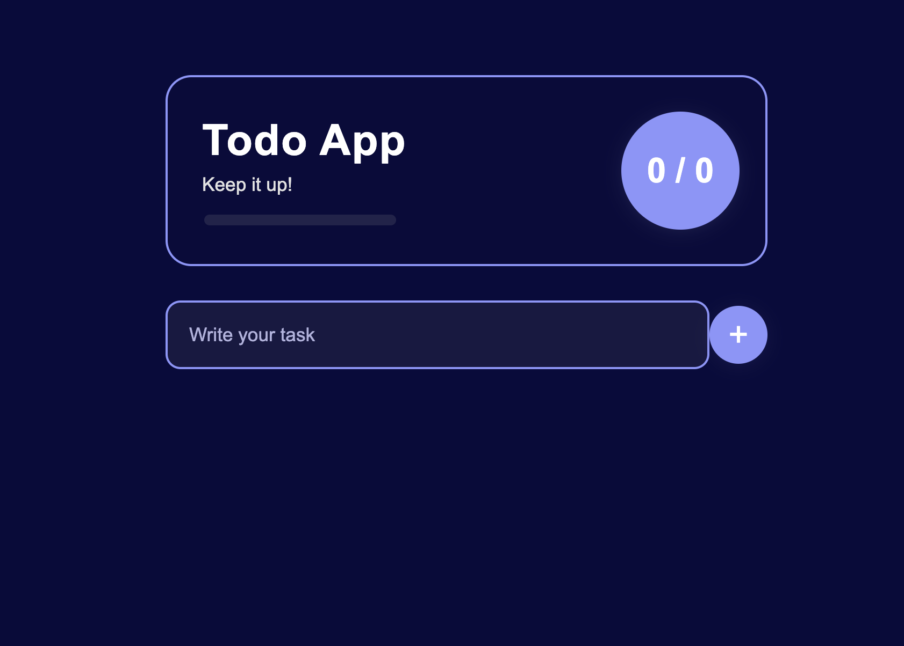
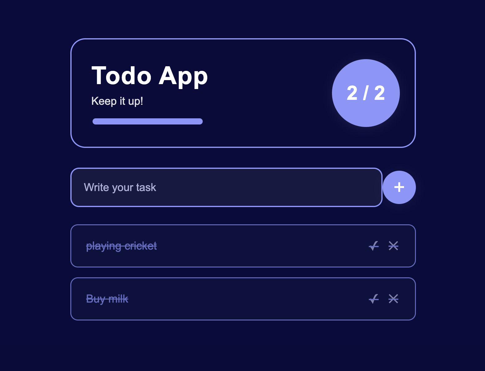

# 🌙 Todo App

A beautiful, minimal **Todo App** built using **HTML, CSS, and JavaScript**.  
Inspired by a modern dark-themed style, this app helps you keep track of your tasks with a clean UI, progress bar, and task counter.



## ✨ Features

- **Add tasks** easily with the input and circular "+" button
- **Mark tasks as completed** (strike-through and color change)
- **Delete tasks** instantly
- **Progress bar** shows completion ratio
- **Modern, dark-themed UI** with card layout and glowing counter
- **Persistent storage** using LocalStorage — your tasks stay after reloading

## 🚀 How it works

1. **Add a new task:**  
   Type your task in the input and click the **"+"** button. Your task appears below.

2. **Complete a task:**  
   Click the checkmark (**✓**) on a task to mark it as done. The progress updates!

3. **Delete a task:**  
   Click the cross (**✕**) to remove a task.

4. **Progress tracking:**  
   The circular indicator and progress bar show how many tasks are completed out of the total.

5. **Persistent:**  
   All tasks are saved in your browser's LocalStorage. Reload the page, and your list remains!

## 📸 Screenshots

### Main App


### Adding a Task


### Completed Tasks



## 🛠️ Installation & Usage

1. **Clone or Download:**

   ```
   git clone https://github.com/ravinder75/To-do-list.git
   ```

2. **Open `index.html` in you/r browser**

   That’s it! No build step needed.

## 📁 File Structure

```
index.html          # Main HTML file
styles.css          # App styling (dark theme, layout, animation)
script.js           # App logic (add, complete, delete, storage)
README.md           # This readme
screenshot.png      # Main UI screenshot
add-task.png        # Adding a task demo
completed-tasks.png # Completed tasks demo
```

## 🎨 Customization

- Change colors in `styles.css` to fit your preference.
- Edit HTML and JS to add new features (like deadlines or categories).

# To-do-list
